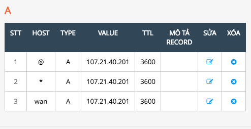
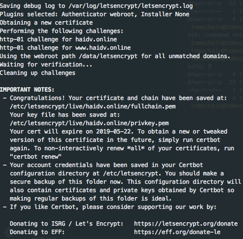
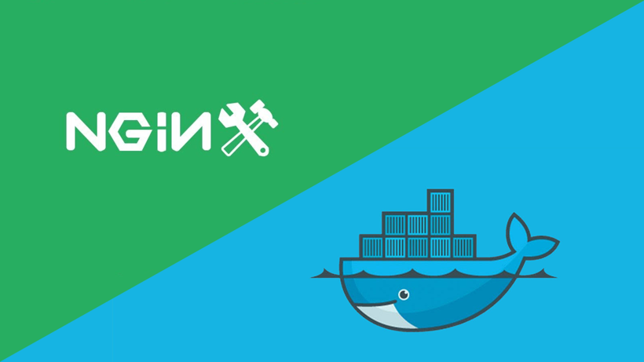

# How to Setup Free SSL Certificates from Let's Encrypt using Docker and Nginx

##  Set up Docker, Nginx and Certbot To Obtain Your First Let's Encrypt SSL/TLS Certificate

### Run the staging command for issuing a new certificate

In your DDNS provider, create A and CNAME record to your server IP



```
sudo docker run -it --rm \
-v /docker-volumes/etc/letsencrypt:/etc/letsencrypt \
-v /docker-volumes/var/lib/letsencrypt:/var/lib/letsencrypt \
-v /docker/letsencrypt-docker-nginx/src/letsencrypt/letsencrypt-site:/data/letsencrypt \
-v "/docker-volumes/var/log/letsencrypt:/var/log/letsencrypt" \
certbot/certbot \
certonly --webroot \
--register-unsafely-without-email --agree-tos \
--webroot-path=/data/letsencrypt \
--staging \
-d haidv.online -d www.haidv.online
```

### Check certificate information

```
sudo docker run --rm -it --name certbot \
-v /docker-volumes/etc/letsencrypt:/etc/letsencrypt \
-v /docker-volumes/var/lib/letsencrypt:/var/lib/letsencrypt \
-v /docker/letsencrypt-docker-nginx/src/letsencrypt/letsencrypt-site:/data/letsencrypt \
certbot/certbot \
--staging \
certificates
```


## Request a production certificate: (note that it's a good idea to supply your email address so that Let's Encrypt can send expiry notifications)

First, clean up staging artifacts:

`sudo rm -rf /docker-volumes/`

Then: 

```
sudo docker run -it --rm \
-v /docker-volumes/etc/letsencrypt:/etc/letsencrypt \
-v /docker-volumes/var/lib/letsencrypt:/var/lib/letsencrypt \
-v /docker/letsencrypt-docker-nginx/src/letsencrypt/letsencrypt-site:/data/letsencrypt \
-v "/docker-volumes/var/log/letsencrypt:/var/log/letsencrypt" \
certbot/certbot \
certonly --webroot \
--email youremail@domain.com --agree-tos --no-eff-email \
--webroot-path=/data/letsencrypt \
-d haidv.online -d www.haidv.online
```



If everything ran successfully, run a docker-compose down command to stop the temporary Nginx site


`cd /docker/letsencrypt-docker-nginx/src/letsencrypt`

`sudo docker-compose down`

## Set up Your Production Site to Run in a Nginx Docker Container



Create the directories for our production site

```
sudo mkdir -p /docker/letsencrypt-docker-nginx/src/production/production-site
sudo mkdir -p /docker/letsencrypt-docker-nginx/src/production/dh-param
```

Let's start with the docker-compose.yml file

`sudo nano /docker/letsencrypt-docker-nginx/src/production/docker-compose.yml`

```
version: '3.1'

services:

  production-nginx-container:
    container_name: 'production-nginx-container'
    image: nginx:1.14.0
    ports:
      - "80:80"
      - "443:443"
    volumes:
      - ./production.conf:/etc/nginx/conf.d/default.conf
      - ./production-site:/usr/share/nginx/html
      - ./dh-param/dhparam-2048.pem:/etc/ssl/certs/dhparam-2048.pem
      - /docker-volumes/etc/letsencrypt/live/haidv.online/fullchain.pem:/etc/letsencrypt/live/haidv.online/fullchain.pem
      - /docker-volumes/etc/letsencrypt/live/haidv.online/privkey.pem:/etc/letsencrypt/live/haidv.online/privkey.pem
      #for certbot challenges
      - /docker-volumes/data/letsencrypt:/data/letsencrypt
    networks:
      - docker-network

networks:
  docker-network:
    driver: bridge
```

The docker-compose does the following:

- Allows ports 80 and 443
- Maps the production Nginx configuration file into the container
- Maps the production site content into the container
- Maps a 2048 bit Diffie–Hellman key exchange file into the container
- Maps the public and private keys into the container
- Sets up a docker network

Next, create the Nginx configuration file for the production site

`sudo nano /docker/letsencrypt-docker-nginx/src/production/production.conf`

```
server {
    listen      80;
    listen [::]:80;
    server_name haidv.online www.haidv.online;

    location / {
        rewrite ^ https://$host$request_uri? permanent;
    }

    #for certbot challenges (renewal process)
    location ~ /.well-known/acme-challenge {
        allow all;
        root /data/letsencrypt;
    }
}

#https://haidv.online
server {
    listen 443 ssl http2;
    listen [::]:443 ssl http2;
    server_name haidv.online;

    server_tokens off;

    ssl_certificate /etc/letsencrypt/live/haidv.online/fullchain.pem;
    ssl_certificate_key /etc/letsencrypt/live/haidv.online/privkey.pem;

    ssl_buffer_size 8k;

    ssl_dhparam /etc/ssl/certs/dhparam-2048.pem;

    ssl_protocols TLSv1.2 TLSv1.1 TLSv1;
    ssl_prefer_server_ciphers on;

    ssl_ciphers ECDH+AESGCM:ECDH+AES256:ECDH+AES128:DH+3DES:!ADH:!AECDH:!MD5;

    ssl_ecdh_curve secp384r1;
    ssl_session_tickets off;

    # OCSP stapling
    ssl_stapling on;
    ssl_stapling_verify on;
    resolver 8.8.8.8;

    return 301 https://www.haidv.online$request_uri;
}

#https://www.haidv.online
server {
    server_name www.haidv.online;
    listen 443 ssl http2;
    listen [::]:443 ssl http2;

    server_tokens off;

    ssl_buffer_size 8k;
    ssl_dhparam /etc/ssl/certs/dhparam-2048.pem;

    ssl_protocols TLSv1.2 TLSv1.1 TLSv1;
    ssl_prefer_server_ciphers on;
    ssl_ciphers ECDH+AESGCM:ECDH+AES256:ECDH+AES128:DH+3DES:!ADH:!AECDH:!MD5;

    ssl_ecdh_curve secp384r1;
    ssl_session_tickets off;

    # OCSP stapling
    ssl_stapling on;
    ssl_stapling_verify on;
    resolver 8.8.8.8 8.8.4.4;

    ssl_certificate /etc/letsencrypt/live/haidv.online/fullchain.pem;
    ssl_certificate_key /etc/letsencrypt/live/haidv.online/privkey.pem;

    location / {
        #security headers
        add_header Strict-Transport-Security "max-age=31536000; includeSubDomains; preload";
        add_header X-XSS-Protection "1; mode=block" always;
        add_header X-Content-Type-Options "nosniff" always;
        add_header X-Frame-Options "DENY" always;
        #CSP
        add_header Content-Security-Policy "frame-src 'self'; script-src 'self' 'unsafe-inline' https://apis.google.com https://platform.twitter.com; child-src https://plusone.google.com https://facebook.com https://platform.twitter.com; img-src 'self'; form-action 'self'; upgrade-insecure-requests;" always;        
        add_header Referrer-Policy "strict-origin-when-cross-origin" always;
        #Feature-policy - Update future
        #add_header Feature-Policy "geolocation none;midi none;notifications none;push none;sync-xhr none;microphone none;camera none;magnetometer none;gyroscope none;speaker self;vibrate none;fullscreen self;payment none;";
    }
    # . files
    location ~ /\.(?!well-known) {
        deny all;
    }

    # assets, media
    location ~* \.(?:css(\.map)?|js(\.map)?|jpe?g|png|gif|ico|cur|heic|webp|tiff?|mp3|m4a|aac|ogg|midi?|wav|mp4|mov|webm|mpe?g|avi|ogv|flv|wmv)$ {
        expires 7d;
        access_log off;
    }

    # svg, fonts
    location ~* \.(?:svgz?|ttf|ttc|otf|eot|woff2?)$ {
        add_header Access-Control-Allow-Origin "*";
        expires 7d;
        access_log off;
    }

    # gzip
    gzip on;
    gzip_vary on;
    gzip_proxied any;
    gzip_comp_level 6;
    gzip_types text/plain text/css text/xml application/json application/javascript application/xml+rss application/atom+xml image/svg+xml;

    #ROOT
    root /usr/share/nginx/html;
    index index.html;
}
```

Generate a 2048 bit DH Param file

`sudo openssl dhparam -out /docker/letsencrypt-docker-nginx/src/production/dh-param/dhparam-2048.pem 2048`

Copy your site content into the mapped directory:

`/docker/letsencrypt-docker-nginx/src/production/production-site/`


Spin up the production site in a Docker container:

```
cd /docker/letsencrypt-docker-nginx/src/production
sudo docker-compose up -d
```

If you open up a browser and point to http://haidv.online, you should see that the site loads correctly and will automatically redirect to https://haidv.online

## How to Renew Let's Encrypt SSL Certificates with Certbot and Docker

## Set Up a Cron Job to Automatically Renew Let's Encrypt SSL/TLS Certificates

```
sudo crontab -e
```

Place the following at the end of the file, then close and save it.

```
0 23 * * * docker run --rm -it --name certbot -v "/docker-volumes/etc/letsencrypt:/etc/letsencrypt" -v "/docker-volumes/var/lib/letsencrypt:/var/lib/letsencrypt" -v "/docker-volumes/data/letsencrypt:/data/letsencrypt" -v "/docker-volumes/var/log/letsencrypt:/var/log/letsencrypt" certbot/certbot renew --webroot -w /data/letsencrypt --quiet && docker kill --signal=HUP production-nginx-container
```